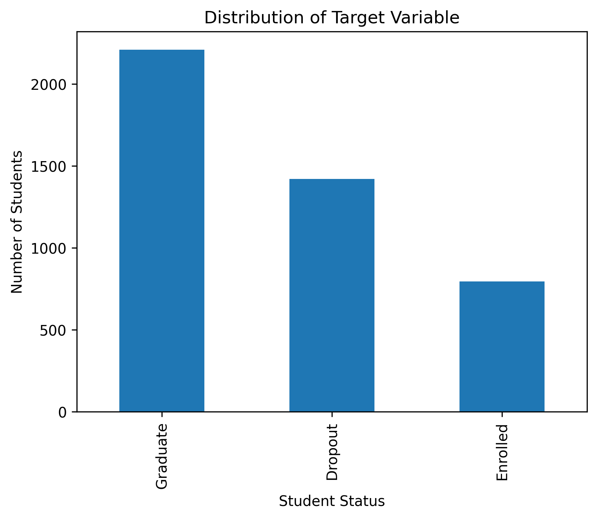
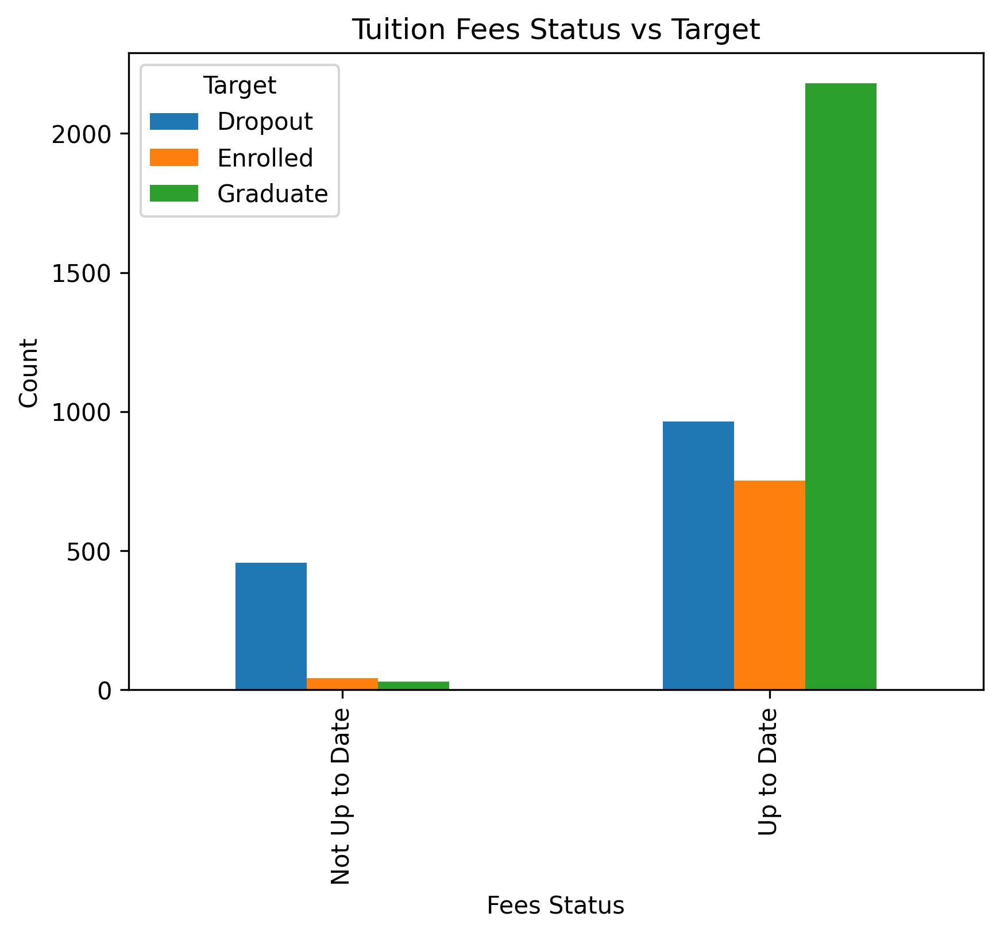
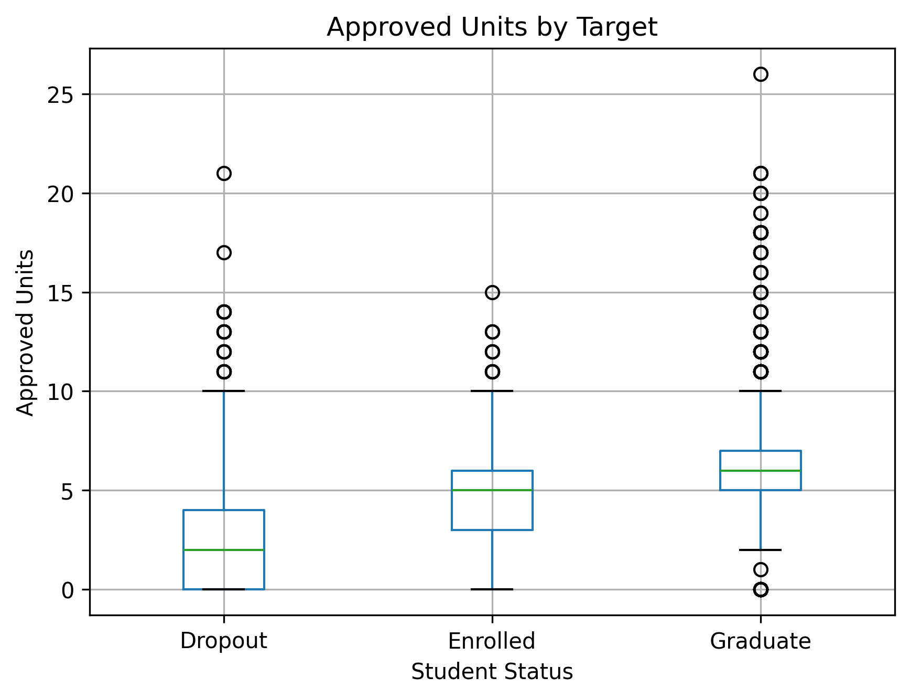
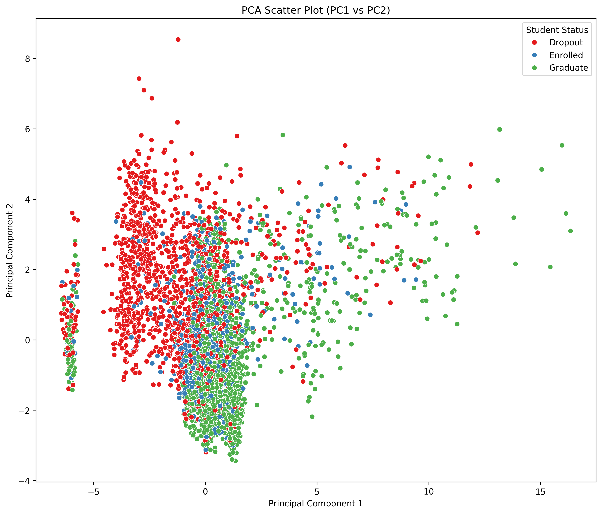

# 📊 Student Dropout Analysis & Prediction
Exploring the factors associated with student dropout through data preparation, exploratory data analysis and dimensionality reduction techniques.

## 📌 Business Problem

Educational institutions face significant challenges in retaining students throughout their academic journey. Student dropout affects institutional performance, increases operational costs and reduces graduation rates. Understanding the factors associated with student dropout can help institutions identify at-risk students earlier and implement targeted intervention strategies.

---

## 🎯 Project Objective

--> The objective of this project is to explore academic, demographic and socio-economic variables associated with student dropout.

--> Through exploratory data analysis, statistical techniques and dimensionality reduction, this project identifies patterns that may support future predictive models for student retention.

---

## 📂 Dataset

Source:

UCI Machine Learning Repository

Target Variable:

Dropout / Graduate / Enrolled

Features include:

Academic performance
Previous education
Financial information
Demographic characteristics
Social factors

---

## 🛠️ Tools and Technologies

Python

Pandas

NumPy

Matplotlib

Scikit-learn

Jupyter Notebook

Principal Component Analysis (PCA)

Statistical Analysis

---

## 🔍 Project Workflow

Data Collection

↓

Data Cleaning

↓

Exploratory Data Analysis

↓

Feature Investigation

↓

Principal Component Analysis

↓

Insights

↓

Future Predictive Model

---
## 📊 Key Visualizations

### 1. Student Outcome Distribution

This chart shows the distribution of students across the three final outcomes: **Graduate**, **Dropout**, and **Enrolled**. It provides an overview of the class balance and highlights that most students successfully completed their studies.

---

### 2. Tuition Fees Status vs Student Outcome

This visualization explores the relationship between tuition fee status and student outcomes. Students with unpaid tuition fees show a noticeably higher proportion of dropouts, suggesting a potential association between financial challenges and academic persistence.

---

### 3. Approved Curricular Units by Student Outcome

The distribution of approved curricular units clearly distinguishes graduates from dropouts. Students with more approved units tend to achieve successful academic outcomes.

---

### 4. Principal Component Analysis (PCA)

The PCA visualization summarizes the dataset into two principal components, helping identify patterns and group separation while reducing dimensionality.

---
## 📊 Key Findings

- Academic performance showed the strongest relationship with dropout.
- Financial variables presented moderate influence.
- PCA successfully reduced data dimensionality while preserving important variance.
- The dataset contains valuable information for future predictive modelling.

---

## 📉 Business Impact

This analysis demonstrates how educational institutions can use data to better understand dropout behaviour and support evidence-based decision making.

The insights generated may contribute to:

Early identification of at-risk students
Better allocation of academic support resources
Improved student retention strategies
Future predictive analytics initiatives

---

## 🚀 Future Improvements

* Machine Learning models
* Hyperparameter tuning
* Feature Engineering
* Interactive Dashboard (Power BI)
* Model Deployment

---

## 👩‍💻 Author

**Marcela Albino**

Higher Diploma in Data Analytics for Business

CCT College Dublin

MSc & PhD in Materials Science

📍 Dublin, Ireland

🔗 LinkedIn: www.linkedin.com/in/marcela-acarvalho

📧 Email: carvalhomarcelaalbino@gmail.com
